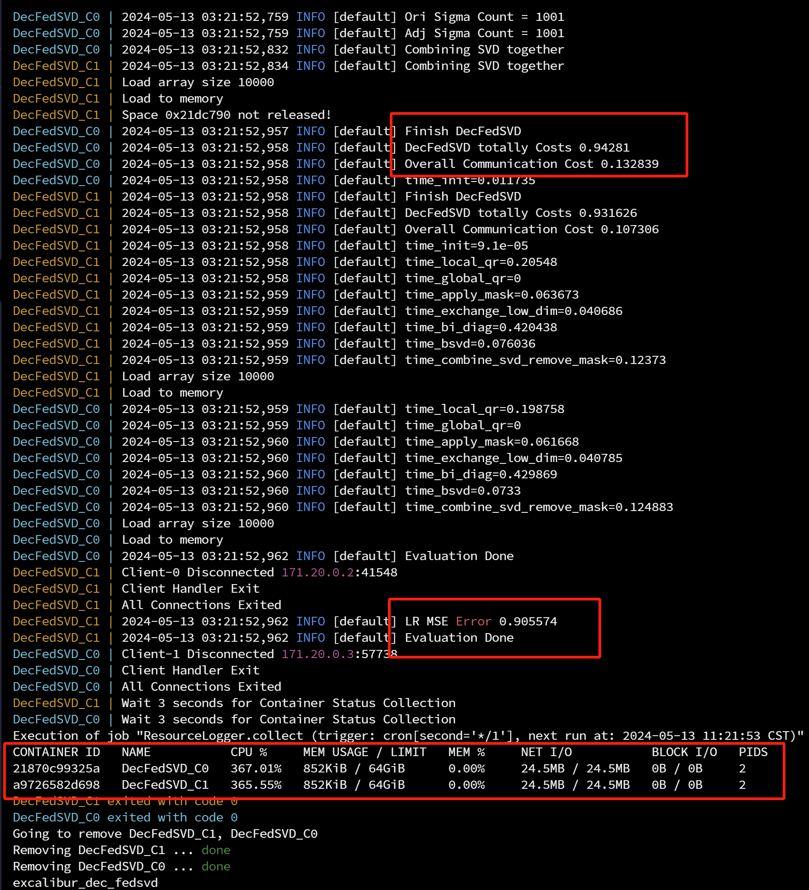
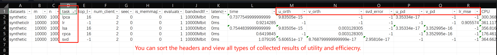

# Excalibur

This is a fully functional Excalibur system for the paper "Efficient Decentralized Federated Singular Vector Decomposition", USENIX ATC'24.

## Project Structure

```
.
├── CMakeLists.txt
├── docker
│   ├── Dockerfile
│   └── requirements.txt
├── generate_data.cpp      // Scripts for generating the data.
├── include
│   ├── base.hpp
│   ├── bbtsvd.hpp
│   ├── client.hpp
│   ├── easylogging++.h
│   └── utils.hpp
├── main.cpp               // The main file executed by each peer
├── python
│   ├── collect_logs.py    // Collecting evaluation results.
│   ├── get_stat.py        // Monitering the container status.
├── README.md
├── src
│   ├── bbtsvd.cpp         // Matrix computation functions.
│   ├── client.cpp         // Communication and workflows.
│   ├── easylogging++.cc   // Only for logging.
│   └── utils.cpp          // Util functions, e.g., the evaluation metrics.
└── trial.py               // Scripts for reproducing the results.
```

Guidelines to read and reuse the code:
- The major system workflow is implemented in `src/client.cpp` and starts at the `DecentralizedClient::run()` function.
- The major matrix computations like factorizing the data and protecting the data are implemented in `src/bbtsvd.cpp`.
- The system runs through docker-compose and different participants are put into different containers. To simplify the process of reproduction, we provide scripts with different options in `trial.py`. To reproduce the results, please first [Prepare the Environments](#prepare-the-environments) and refer to [Reproduce the Results](#reproduce-the-results) for more details.

## Getting Started Instructions

#### Step 1: OS and software.

The system is implemented on Linux OS (tested on Ubuntu 20.04) and the following software is needed to reproduce the results:

- Docker
  - [Installing instructions.](https://docs.docker.com/engine/install/ubuntu/)
  - Please also ensure the "docker" command can be executed without sudo. 
  - Tested version: Docker version 20.10.21
- Docker-compose
  - [Installing instructions.](https://docs.docker.com/compose/install/linux/)
  - Tested version: docker-compose version 1.28.5
- MiniConda
  - [Installing instructions.](https://docs.anaconda.com/free/miniconda/miniconda-install/)
  - Tested version: conda 23.5.2

#### Step 2: Build the docker image and create the python env.

```bash
git clone https://github.com/Di-Chai/Excalibur
cd Excalibur
docker build docker/ -t excalibur:v1    // Building the image may take more than 10Mins.
conda create -y -n excalibur python=3.8
conda activate excalibur
pip install -r docker/requirements.txt
```

#### Step 3: Quick testing.

```bash
# Env: conda activate excalibur.
# This will test SVD and its three applications using synthetic data.
python trial.py test
# Collect the results and rename the files
python python/collect_logs.py logs/
mv logs tmp_test
```

If everything goes well, you will see the system execution process.



And the `tmp_test/result.csv` contains all the test results.



## Detailed Instructions to Reproduce the Results

#### Step 1: Download the datasets.

Download the dataset from:
- Google Drive: https://drive.google.com/file/d/1eqKgZiisBMhWQNZBDBMAlmcUFOdvtdV5/view?usp=drive_link
- Or Nutstore storage: https://www.jianguoyun.com/p/DTMf944QhdfRChi9y8IFIAA

Extract the data to the project path through `tar -zxvf datasets.tar.gz`.

The file tree after extraction:

```
├── datasets
│   ├── ml100k
│   ├── ml25m
│   ├── mnist
│   ├── synthetic
│   ├── syntheticlr
│   ├── synthetic_very_large
│   └── wine
├── docker
├── include
└── src
```

#### Step 2: Reproduce the results using scripts.

The scripts use the docker-bridge network with subnet 171.20.0.0/24. If you already have a docker network with a conflict subnet, please remove it before running the scripts. For the detailed testbed, please refer to Section 8.1 in our paper.

```bash
# Create one folder for storing the results.
mkdir records
```

----

Reproducing the accuracy results, i.e., Table 3.

```bash
# This will cost about 1 minutes.
python trial.py accuracy
# Collect the results and rename the files
python python/collect_logs.py logs/
mv logs records/accuracy
```

Please compare the `svd_error` in 'records/accuracy/results.csv' with Table 3 in the paper.

**Tips: `results.csv` could be opened using Microsoft Excel (or other tools), which is better for sorting and viewing the results.**

----

Reproducing the efficiency results on SVD tasks, i.e., Figure 8.
```bash
# This will cost more than 10 hours using 8 cores (2 participants), 128GB RAM, and 2TB SSD storage.
python trial.py large_scale_svd_short_wide
python trial.py large_scale_svd_tall_skinny
# This will cost 1~2 hours.
python trial.py bandwidth
python trial.py latency
# Collect the results and rename the files
python python/collect_logs.py logs/
mv logs records/large_scale_svd
```

Please compare the `time` (seconds) in 'records/large_scale_svd/results.csv' with Figure 8 in the paper.

----

Reproducing the comparison to the HE-based method on the PCA application, i.e., Table 4.
```bash
# This will cost 3~4 minutes and require machine with at least 24 cores and about 256GB RAM to support 6 participants.
python trial.py comparing_to_sfpca
# Collect the results and rename the files
python python/collect_logs.py logs/
mv logs records/comparing_to_sfpca
```

Please compare the `time` (seconds) in 'records/comparing_to_sfpca/results.csv' with Table 4 in the paper.

----

Reproducing the comparison results on LR application, i.e., Figure 10.
```bash
# This will cost more than 10 hours using 8 cores CPU (2 participants), 128GB RAM, and 2TB SSD storage.
python trial.py large_scale_lr_tall_skinny
# Collect the results and rename the files
python python/collect_logs.py logs/
mv logs records/large_scale_lr_tall_skinny
```

Please compare the `time` (seconds) in 'records/large_scale_lr_tall_skinny/results.csv' with Figure 10 in the paper.

----

Reproducing the scalability results, i.e., Figure 11.
```bash
# This will cost abour an hour and require machine with 80 cores to support up to 20 participants.
# (Or you can adjust `core_per_peer = 4` in trial.py to reduce the required cores (e.g., `core_per_peer = 1`) but may get longer runtime.)
python trial.py vary_num_clients_ts
# Collect the results and rename the files
python python/collect_logs.py logs/
mv logs records/vary_num_clients_ts
```

Please compare the `time` (seconds) in 'records/vary_num_clients_ts/results.csv' with Figure 11 in the paper.

----

Reproducing the results with and without the proposed optimizations, i.e., Figure 12.
```bash
# This will cost more than 10 hours since it takes significant long time without the proposed optimizations.
python trial.py opt
```

Please compare the `totally Costs` and `Overall Communication Cost` (seconds) in log files of 'records/opt/' with Figure 12 in the paper.

## Mannually Build the System (for debugging or reuse for other projects)

With docker:

```bash
mkdir build
docker run -it --rm -v $(pwd):/data -w /data/build excalibur:v1 bash -c "cmake .. && make"
```

Without docker (need Intel MKL installed, [install instructions](https://www.intel.com/content/www/us/en/developer/tools/oneapi/base-toolkit-download.html)):

```bash
mkdir build
source /opt/intel/oneapi/setvars.sh
cd build
cmake ..
make
```
